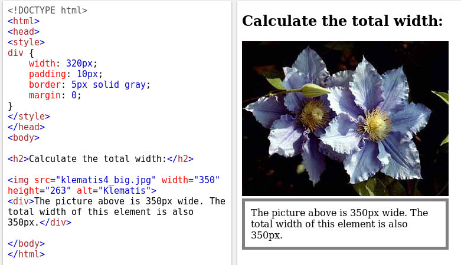

# Laatikkomalli (Box Model)

Kaikki html-elementit voidaan nähdä laatikoina:

1. Uloin osa on marginaali. Tämä on läpinäkyvä
1. Marginaalia seuraa reunus (border)
1. reunan jälkeen täyte (padding), kuinka kaukana sisusta on reunuksesta
1. ja lopuksi itse sisältö.

Kun tehdään sivuston suunnittelua, on tärkeää huomioda, miten elementin kokonaisleveys (tai -korkeus) lasketaan:

Leveys: 2 x maginaali + 2 x reunus + 2 x täyte + sisältö. Esimerkiksi:

Kuvan leveys on 350 pikseliä. Laatikon sisältö on 320 pikseliä, täyte 10 pikseliä, reunus 5 pikseliä sekä marginaali 0. Näin ollen kokonaisleveys on 

2 x 0px + 2 x 5px + 2 x 10px + 320px = 350px.

