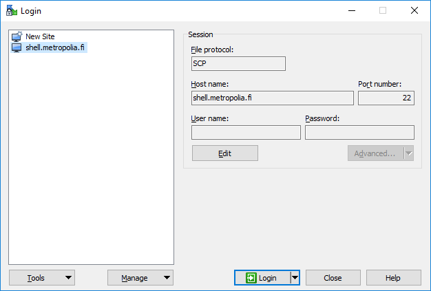
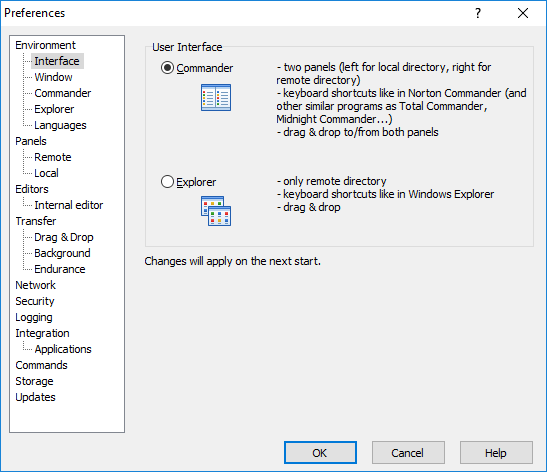
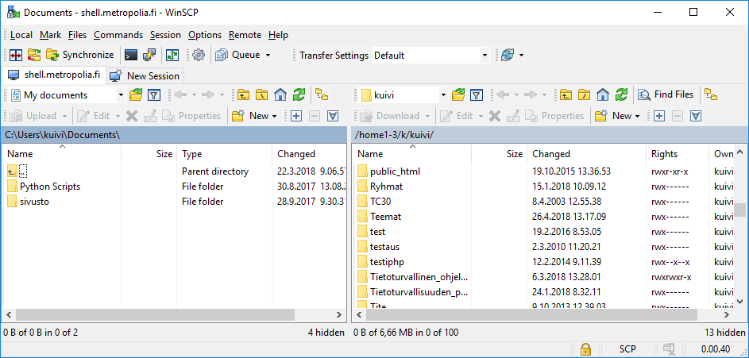

# Web-sivujen julkaiseminen

Jotta sivut näkyisivät netissä, tulee olla nettiin näkyvä palvelin, jolla ne voidaan julkaista. Tällaista palvelua tarjoavat useat palveluntarjoajat. Metropoliassa web-sivut voi julkaista koulun palvelimella, kopioimalla ne oman verkkolevyn (Z-levy) hakemistoon nimeltään *public_html*. 

Kopioitaessa sivut tänne, ne löytää osoitteella 

`http://users.metropolia.fi/~ktunnus/`

jossa *ktunnus* on käyttäjätunnuksesi Metropolian järjestelmiin. Jos olet tallettanut etusivusi nimellä *index.html*, näet nyt etusivusi sisällön. Yksittäiseen sivuun voit viitata kirjoittamalla sivun nimen perään:

`http://users.metropolia.fi/~ktunnus/sivu.html`

Https-protokolla on myöskin tuettu, jos sille on tarvetta

Tuotettaessa sivuja paikallisesti omalla läppärillä, täytyy kaikki kotisivuihin liittyvät tiedostot kopioida kohteeseen siitä hakemistosta, mihin ne on läppärilleen tallentanut. Seuraavassa esitellään vaihtoehtoisia tapoja tehdä tämä:

## 1. Webdisk

Webdisk on www-pohjainen työkalu, jonka avulla tiedostojen kopiointi omalta koneelta verkkolevylle onnistuu helposti asentamatta mitään muita ohjelmia. Sinne pääsee joko OMA:n valikkojen kautta taikka suoraan osoitteella

[https://webdisk.metropolia.fi/](https://webdisk.metropolia.fi/)

Tänne kirjaudutaan samalla tunnus-salasanaparilla kuin muihinkin Metropolian järjestelmiin. 

## 2. WinSCP ja Filezilla

[WinSCP](https://winscp.net/eng/index.php) on paljon käytetty secure copy -client (asiakas) Windowsille. Sillä voi muodostaa suojatun yhteyden linux-palvelimelle. Se on myöskin Open Source -ohjelma, joten sen voi ladata itselleen aivan ilmaiseksi. Verkkolevylle pääset kirjatumalla palvelimelle nimeltään *shell.metropolia.fi*. Käyttäjänimeksi ja salasanaksi tulevat käyttäjätunnuksesi sekä salasanasi, joilla kirjaudut mm. OMA:aan. 

Ohjelmassa on kaksi näyttömoodia: 

Commander jakaa näytön kahteen osaan: 

Vasemmalla on paikallinen kansio ja oikealla palvelimen kansio. Explorer toimii kuten tavanomainen Windows-kansio ja näyttäkin siltä.  

[FileZilla](https://filezilla-project.org/) on sitten toinen vastaava ohjelma. Tähän saa myös Apple-käyttäjille oman version.

## 3. Linux-käyttäjät ja scp

Linuxissa voit käyttää komentoriviä ja scp-ohjelmaa:

`scp tiedosto(t) ktunnus@shell.metropolia.fi: `

Eli aluksi kerrot tiedostot, jotka kopioit, voit käyttää jokerimerkkejä (?, *). Sen jälkeen käyttäjätunnuksesi (ktunnus esimerkissä) ja osoite shell.metropolia.fi. **Huomaa kaksoispiste!** Se on laitettava ehdottomasti mukaan, jos haluat kopionnin toimivan. Kaksoispisteen jälkeen voi toki laittaa vielä kohdehakemiston (esim. public_html), jos haluaa. Onnistuneen kopioinnin tuntee siitä, että ennen kopioinnin alkua kysytään salasanasi.

Myöskin työpöytien tiedostoselaimet hallitsevat scp:n taikka sftp:n.
