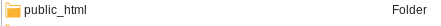

# Web-sivujen julkaiseminen

Jotta sivut näkyisivät netissä, tulee olla nettiin näkyvä palvelin, jolla ne voidaan julkaista. Tällaista palvelua tarjoavat useat palveluntarjoajat. Metropoliassa web-sivut voi julkaista koulun palvelimella, kopioimalla ne oman verkkolevyn (Z-levy) hakemistoon nimeltään *public_html*. 

Kopioitaessa sivut tänne, ne löytää osoitteella 

`http://users.metropolia.fi/~ktunnus/`

jossa *ktunnus* on käyttäjätunnuksesi Metropolian järjestelmiin. Jos olet tallettanut etusivusi nimellä *index.html*, näet nyt etusivusi sisällön. Yksittäiseen sivuun voit viitata kirjoittamalla sivun nimen perään:

`http://users.metropolia.fi/~ktunnus/sivu.html`

Https-protokolla on myöskin tuettu, jos sille on tarvetta

Tuotettaessa sivuja paikallisesti omalla läppärillä, täytyy kaikki kotisivuihin liittyvät tiedostot kopioida kohteeseen siitä hakemistosta, mihin ne on läppärilleen tallentanut. Seuraavassa esitellään vaihtoehtoisia tapoja tehdä tämä:

## 1. Webdisk

Webdisk on www-pohjainen työkalu, jonka avulla tiedostojen kopiointi omalta koneelta verkkolevylle onnistuu helposti asentamatta mitään muita ohjelmia. Sinne pääsee joko OMA:n valikkojen kautta taikka suoraan osoitteella

[https://webdisk.metropolia.fi/](https://webdisk.metropolia.fi/)

Tänne kirjaudutaan samalla tunnus-salasanaparilla kuin muihinkin Metropolian järjestelmiin. 

## 2. WinSCP ja Filezilla

## 3. Linux-käyttäjät ja scp