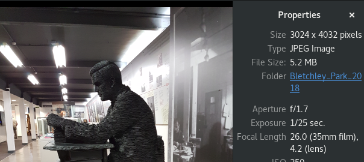
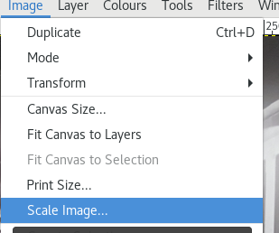
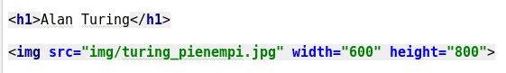
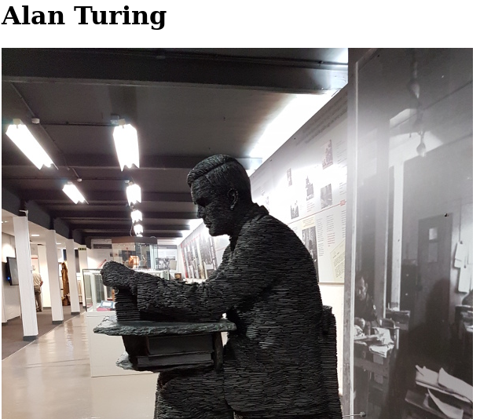

# Kuvat

Kuvat ovat keskeisiä elementtejä html-dokumenteissa. Kuvat liitetään ``-tagilla html-sivuun, esimerkiksi

``

Esimerkissä viitataan *img*-hakemistoon, jossa kuva sijaitsee. Kuvan leveys ja korkeus pikseleinä eivät ole välttämättömät ilmoittaa, mutta ne auttavat selainta renderöimään sivua. 

## Kuvan muokkaaminen webbisivulle sopivaksi

Yleensä ennenkuin kuva voidaan liittää sivulle, se täytyy hankkia jostain. Useinmiten se on nykyisin joko kameralla taikka puhelimen kameralla otettu digikuva. Ensinnäkin kuvan on oltava sivulle sopivassa formaatissa:

  * jpg (jpeg). Yleensä valokuvissa käytetty tiedostoformaatti. Ominaisuutena säädettävä kuvan pakkaus (tiivistäminen). Mitä suurempi pakkaus, sitä epätarkempi kuva sekä pienempi tiedostokoko
  * png (portable network graphics). Grafiikassa ja ruutukaappauksissa käyttökelpoinen formaatti. Häviämätön, eli säilyttää datansa, vaikka talletettaessa tehdäänkin tiivistys. Osaa kuvasta voi säätää läpinäkyväksi.
  * gif. Vanha tiedostoformaatti, joka voi esittää 256 väriä. Gif:llä voi määrittää läpinäkyvän taustan sekä esittää pieniä animaatioita.

Jos on ottanut kuvan puhelimensa kameralla, se on yleensä valmiiksi jpg-formaatissa, ja sen voi periaatteessa suoraan laittaa webbisivulle ja säätää sopivan kokoisiksi leveys- ja korkeusattribuuteilla. Esimerkiksi seuraava kuva on kooltaan 5,2 MB, leveys 3024 ja korkeus 4032 pikseliä:

Kuvan skaalaaminen pienempään kokoon ei kuitenkaan pienennä kuvan tiedostokokoa ja jo muutaman tällaisen kuvan liittäminen sivustolle tekee siitä hyvin raskaan. Siksipä kuva pitää skaalata pienempään kokoon: 

Kun muutat kuvan kokoa, tee ensin kuvasta kopio ja muuta kopiota. Jos kuvaa pienentää, siitä ei saa enää samantasoista alkuperäistä kuvaa kuin alkuperäinen kuva oli.

Se, mikä on järkevä koko, riippuu paljolti siitä, miten kuva halutaan sivulla esittää. Joka tapauksessa on syytä valita jokin sellainen kuvakoko, jota voi katsella helposti selainikkunassa. 

Jos välttämättä tarvitaan kuva alkuperäisessä koossaan, on järkevää tehdä pienestä kuvasta linkki suurempaan kuvaan, jolloin suurempi kuva ladataan vain haluttaessa.

Esimerkkikoodi

tuottaa tällaisen sivun (kuvasta näkyy vain osa)

Kuvan muokkauksesta tarkemmin kurssin kuvankäsittelyosiossa.

