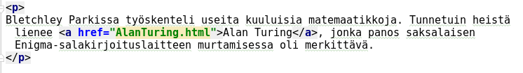
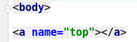
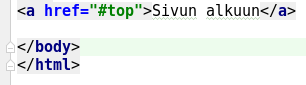
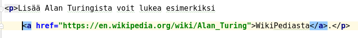

# Linkkejä sivulle

Hypertekstin tärkeimpiä ominaisuuksia ovat linkit. Niiden toteutus tapahtuu `<a>`-tagilla:

`<a href="tokasivu.html">Toiselle sivulle</a>`

Tämä siis luo linkin, jossa tekstistä "Toiselle sivulle" klikkaamalla pääsee sivulle *tokasivu.html*

Tätä voi käyttää esim. näin:

Kuvassa on kappaleeseen lisätty linkki, josta siirrytään *AlanTuring.html*-nimiselle sivulle.

Linkkejä voi olla myös sivun sisäisiä. Ne tehdään merkitsemällä ensiksi paikka, mihin halutaan siirtyä:

`<a name="paikka">`

Tähän sitten siirrytään näin:

`<a href="#paikka">Toiseen paikkaan samalla sivulla</a>`

Esimerkiksi voit nimetä sivun ylälaidan näin:

Johon voit siirtyä sivun alalaidasta seuraavasti:

Ulkoiset linkit pitää määritellä http- taikka https-protokollalla:

`<a href="http://www.example.com">Siirry sivustolle www.example.com</a>`.

Yleisin virhe tässä kohdin on unohtaa alusta määre `http://`. Tällöin linkkiä kohdellaan paikallisena tiedostona eikä tietenkään siirtyminen onnistu.

Tässä esimerkissä siirrytään WikiPediaan:

### Vältä tätä!

Yleisin virhe tehtäessä linkkejä lienee se, että linkki osoittaa johonkin paikalliseen tiedostoon, tähän tyyliin:

`<a href="file://C:/users/ktunnus/kotisivut/tokasivu.html">Toiselle sivulle</a>`

Tällaisen saa aikaiseksi yleensä silloin, kun yrittää viitata jonnekin kotisivuhakemiston ulkopuolelle taikka jossain tilanteissa (riippuen editorista) kun et ole tallettanut kirjoittamaasi html-sivua minnekään. Tällöin tiedostoviittauksista tulee helposti ns. absoluuttisia. Näitä ei usein havaitse testivaiheessa, koska omalla koneella on tietenkin tuollainen hakemisto ja tiedosto näkyy ihan hyvin sivuilla.

