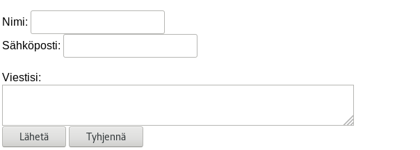
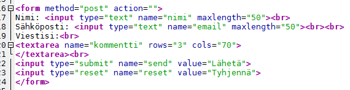

# Lomakkeet HTML:ssä

Web-julkaisuihin liittyy usein palautesivu, jossa palautetta saa antaa seuraavankaltaisen palautelomakkeen kautta:

Lomakkeessa on käytännössä viisi elementtiä: Aluksi kaksi tekstikenttää (nimi ja sähköposti), joiden jälkeen vapaan tekstin tekstialue ja lopuksi kaksi nappulaa, joista toinen lähettää lomakkeen tiedot ja toinen tyhjentää lomakkeen. Lomakkeen koodi näyttää katsottaessa tältä:

Lomake siis aloitetaan `<form>`-tagilla, johon lisätään metodi, jolla lomake käsitellään. Tässä metodi on POST, jossa lomake lähetettään nappia painamalla. Action-kohta on tyhjä, tätä esimerkkilomaketta ei siis lähetetä mihinkään.

Lomake tarvitsee aina käsitellä erikseen jollakin tavalla. HTML-kieli ei sisällä mitään työkaluja lomakkeella kerätyn datan käsittelemiseen. Jos halutaan käsitellä lomakkeen sisältö selaimessa, voidaan käyttää JavaScriptiä. Jos taas käsittely tehdään palvelinpuolella, tarvitaan jokin palvelinpuolella ajettava skriptikieli, esimerkiksi PHP. Tällä jaksolla käsitellään vain asiakaspuolen (selain) toimintaa. 

Toinen vaihtoehto POST-käsittelyn sijasta on GET, jolloin lomakedata välitetään URL:n mukana. 

## Lomakekenttiä

Eri tarpeisiin on erilaisia lomakekenttiä, muun muassa seuraavia:  

- tekstikenttä
- salasanakenttä (HUOM! tämän "salaisuus" on siinä, ettei se kaiuta ruudulle sitä, mitä kenttään kirjoitetaan
- tekstialue (useita rivejä tekstiä)
- valintaruudut (monivalinta)
- radio-nappula (voit valita vain yhden)
- listoja 
- jne...

Lisäksi HTML5 on tuonut uusia lomakekenttiä mukanaan.

Listan lomakekentistä löydät esim. osoittesta [W3Schools:sta.](https://www.w3schools.com/html/html_forms.asp)

## Lomakkeiden käsittelystä sekä turvallisuudesta.

HTML-kieli antaa mahdollisuuden rakentaa erilaisia lomakkeita, mutta se ei tarjoa vastausta sille, miten lomake tulee käsitellä taikka mihin data tulee välittää. Sitä varten tarvitaan jokin lomakekäsittelijä, eli jokin skripti, joka tekee lomakkeelle halutut toimenpiteet. Tämä onnistuu sopivalla skriptikielellä. Yksi tällainen kieli on PHP, josta esimerkki erillisellä sivulla. Myöskin muut skriptikielet sopivat tähän tarkoitukseen, esimerkiksi Pythonillakin voi käsitellä lomakedataa, samoin JavaScript.

Turvallisuus on lisäksi erittäin tärkeä osa lomakkeiden käsittelyä. Aina on varmistuttava siitä, että lomake välittää vain sellaista dataa, jota sen on tarkoituskin välittää, eli mitään ylimääräistä lomakkeesen ei pidä päästä syöttämään. Tällaista ylimääräistä ovat muun muassa seuraavat asiat:

   - html-tagit. Jos palautteessa ei tarvita html-koodia, sitä ei saa hyväksyä. Esimerkiksi `<script>`-tagi muodostuu helposti vaaralliseksi, koska tuo sallii Javascriptin ajamisen. Tätä kutsutaan nimellä Cross Site Scripting (XSS).
- tietokantaliittymissä on estettävä kyselyihin yritettävät SQL-temput, joilla pyritään saamaan tietokannasta enemmän tietoa irti kuin olisi tarkoitus taikka yritetään tuhota taikka sotkea tietokannan tauluja. Tätä kutsutaan nimellä injektio (Injection).

Se, miten helppoa näiden torjunta on, riippuu paljolti käytetystä kielestä. Useat kielet sisältävät nykyisin omia turvallisuutta lisääviä ominaisuuksia. Itse ei tarvitse pyörää keksiä tässä tilanteessa uudestaan.

HTML5 tarjoaa myös erilaisia tarkistusmahdollisuuksia lomakkeelle syötettävälle datalle. Sillä voi estää tyhjien kenttien lähettämisen (required-attribuutti), tarkistaa sähköpostikentän syntaksin (erillinen email-kenttätyyppi) sekä tarkistaa että lomakkeen kenttään on syötetty oikeanmuotoista dataa (pattern-attribuutti). Näistä ja muista HTML5:n ominaisuuksista lisää esimerkiksi [tästä](https://www.w3schools.com/html/html_form_attributes.asp) linkistä.

## OWASP - Open Web Applications Security Project

[OWASP](https://www.owasp.org/index.php/Main_Page)on voittoa tavoittelmaton yhteisö, jonka tarkoituksena on lisätä käyttäjien tietoisuutta web-sovellusten turvallisuudesta sekä kehittää työkaluja turvallisuuden testaamiseen. Lisäksi OWASP julkaisee säännöllisesti [top 10](https://www.owasp.org/index.php/Category:OWASP_Top_Ten_Project) -listaa, jossa esitellään sen hetken yleisimmät uhat web-sovellusten turvallisuudelle. Web-sovellusten kehittämisestä kiinnostuneille tärkeä sivusto.