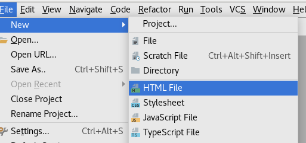
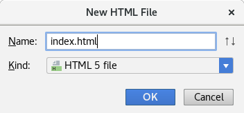
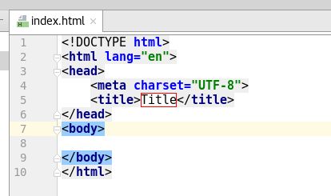
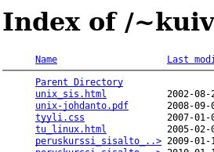
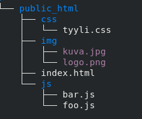

# HTML5, sivuston rakenne

HTML-dokumentti rakentuu seuraavista osista:

1. Dokumenttityyppi, joka kertoo käytetyn HTML-kielen version
1. `<html>`-tagista, jonka sisään tulee kaksi osaa
    1. `<head>`: tänne tulevat kaikki otsikko- ja määrittelytiedot: Sivun otsikkorivi, käytetty merkistö, linkki CSS-tiedostoihin jne.
    1. `<body>`: tänne taas kirjoitetaan sivun varsinainen sisältö

Jokainen osa tulee päättää lopputagilla, joka on sama kuin tagi itse, mutta alkaa kauttaviivalla ( / ), esimerkiksi `</body>`.

Eli siis tällainen on jokaisen HTML-sivun runko:

```html
<!DOCTYPE html>
<html>
    <head>

    </head>
    <body>

    </body>
</html>
```


## HTML-sivun luominen WebStormilla

Kun projekti on luotu, siihen voi lisätä tiedostoja. Aloitetaan Files-valikosta, josta valitaan New | HTML-file:



Valinnan jälkeen annetaan tiedostolle nimi ja valitaan, mitä HTML-kielen versiota käytetään. Kuvassa on valittu HTML5:



Tämä kannattaa tehdä näin sen takia, että WebStorm helpottaa käyttäjän työtä lisäämällä dokumenttiin automaattisesti edellä mainitut tagit:



Nyt olemmekin valmiit aloittamaan. 

## Tiedostojen nimeämisestä sekä ns. indeksitiedosto

Tiedostojen nimeäminen on staattisia web-sivuja tehtäessä varsin vapaata, kunhan antaa tiedoston päätteeksi joko *.html* taikka *.htm*. Pääte kertoo web-selaimelle, että sivu on html-koodia ja lisäksi webserveri ymmärtää sivun html-koodiksi eikä ryhdy tekemään sille mitään erityistä. 

On kuitenkin syytä huomata, että nyt isot ja pienet kirjaimet ovat eri asia. Esimerkiksi *testi.html* ja *TESTI.html* ovat kaksi eri tiedostoa!

Web-sivuston etusivun nimeksi kuitenkin on järkevää antaa ennalta määrätty sivun nimi, joka on yleensä *index.html* (tai *index.htm*) tämä sen takia, että sivuihin viitataan yleensä sen osoitteella, kuten esimerkiksi 

`http://www.example.com`

Tällöin haetaan ns. indeksitiedosto, joka näytetään osoitteeseen menijälle. Kun ei ilmoiteta mitään erillistä sivua, näytetään juuri tämä indeksitiedosto (*index.html*). Näin ei erikseen tarvitse tietää, miten sivujen laatija on päättänyt etusivunsa nimetä.

Jos indeksitiedostoa ei ole, käyttäjälle saatetaan näyttää webserveriltä hakemisto, johon osoite viittaa. Tämä tosin riippuu hakemiston oikeuksien määrittelystä. Hakemisto saattaa sisältää tiedostoja, joita vierailjan ei haluttaisi näkevän, joten indeksitiedosto myöskin lisää webpalvelimen tietoturvallisuutta. Näkymä voi olla jotain tällaista:

)

## Datan organisoinnista

Koska html-sivusto sisältää nykyisin erilaisia tiedostoja, kuten

- Html-sivuja
- Kuvia
- Css- eli tyylitiedostoja
- JavaScriptiä

kannattaa jo alusta pitäen lähteä siitä, että luodaan eri asioille omat hakemistonsa, esimerkiksi tähän tyyliin:



Kuvassa siis kotihakemiston (public_html) alle luotu kolme hakemistoa (css, img sekä js). Hakemistojen sisältö lienee ilmeinen... 

Näin voidaan organisoida ja hallita tiedeostoja paremmin kuin siinä tapauksessa, kuin kaikki tiedostot olisivat sekaisin yhdessä hakemistossa.

Laajoilla sivustoilla voidaan myös html-sivuja jakaa eri alikansioihin.
