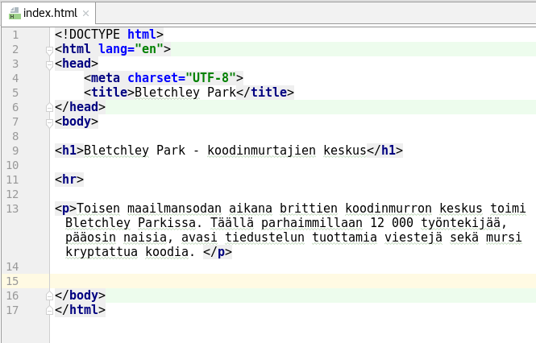
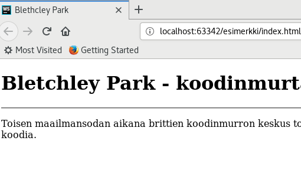
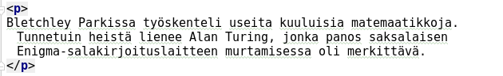
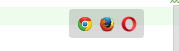

# Sivuston toteuttaminen

Tässä dokumentissa käydään läpi esimerkkisivuston toteuttaminen sekä esitellään eräitä yleisimpiä html-tageja.

## Aloitetaan

Koodin otsikkotiedot sekä ns. metadata kirjoitetaan `<head>`-osion sisään. Tärkeimpänä `<title>`, johon tulee otsikkoteksti, joka näkyy selaimen otsikkorivillä. Esimerkissä on lisäksi määritelty merkistöksi UTF-8, joka on nykyisin yleisimmin käytössä oleva merkistö. Näin sivusto osaa näyttää kaikki kansalliset merkit (esim. åäöü jne) oikein sivustolla.

Itse sivuston sisältö kirjoitetaan sittten `<body>`-tagien väliin. Tähän esimerkkiin on kirjoitettu kolme tagia:

- h1 määrittää ylimmän otsikkotason. Kaikkiaan otsikkotasoja on 9. (h1..h9)
- hr on taas vaakasuuntainen viiva (horzontal row). Tässä kohtaa lähinnä koriste, mutta joskus hyödyllinen sivun jaossa eri osiin. 
- p, eli paragraph on tagi, jonka sisään kaikki data kirjoitetaan. Tämä ei siis tarkoita, että tämän yhden tagiparin sisään, vaan jokainen kappale kirjoitetaan omaan kappaleeseensa

Huomaa, että rivinvaihto ei kappaleen sisässä merkitse mitään. Selain vasta rivittää tekstin. Tämäkin koodi näyttää eräässä selainikkunassa seuraavalta:

Kun sivustoa jatketaan, seuraava kappale kirjoitetaan uuteen p-tagiin, näin:

## Koodin testaus selaimessa

WebStormissa koodia voi katsella selaimessa viemällä kursorin koodi-ikkunan oikeaan ylälaitaan sekä valita sieltä haluttu selain, jossa koodia haluaa tarkistella. Luonnollisesti selain tulee olla asennettu koneeseen, jossa testaus tapahtuu:

Kuvassa valittavissa Chrome, Firefox sekä Opera. Vaikka kuvassa näkyykin selaimen symboli, se ei välttämättä tarkoita, että selain on asennettu koneeseen. Esimerkissä Operaa ei ole asennettu.

