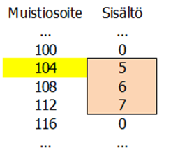

# Funktiot

Funktio on ohjelman osa, joka tekee rajatun toimenpidekokonaisuuden.
Taustalla on modulaarisuusajatus: koska samaa asiaa ei kannata toteuttaa moneen kertaan, kannattaa
yleiskäyttöiset osat ohjelmasta kirjoittaa funktioina, joita voidaan käyttää ohjelman sisällä
useaan otteeseen.

Jo ohjelmoitua funktiota voi ajatella tällöin ”mustana laatikkona”. Sen voi ottaa aina tarvittaessa käyttöön - onhan se jo kertaalleen ohjelmoitu ja testattu huolellisesti.

Funktiota kutsutaan (eli käytetään) pääohjelmasta eli funktioiden ulkopuolisesta ohjelmanosasta. Funktiot voivat myös kutsua  toisiaan.
Myös web-sivulle upotettu painike voi käynnistää funktion.

JavaScript-kieli tukee kahta funktioiden kirjoitustapaa:
- `function`-lauseina kirjoitetut funktiot
- nuolifunktiot.

Ensin mainittu `function`-lauseena  kirjoitettu funktio edustaa proseduraalisten ohjelmointikielten vakiintunutta funktioiden kirjoitustapaa.
Nuolifunktiot puolestaan edustavat uutta funktionaalista ohjelmointiparadigmaa, jossa kirjoitetaan tilattomia ja sivuvaikutuksettomia funktioita.

Funktionaalista ohjelmointiparadigmaa pidetään vaikeampana oppia, ja nuolifunktioiden avulla
tuotettu JavaScript-koodi on tiiviimpää ja kehittäjälle ainakin aluksi haastavampaa ymmärtää ja tuottaa.

Tästä syystä tämän sivun pääpaino on
 `function`-lauseen avulla kirjoitetuissa funktioissa. Sivun lopussa kuitenkin kurkistetaan myös nuolifunktioiden laatimiseen. 


## Parametriton ja paluuarvoton funktio

Tarkastellaan aluksi esimerkkiä parametrittomasta ja paluuarvottomasta funktiosta.
Tällainen funktio tekee aina kutsuttaessa saman asian: sen toiminnallisuutta ei voi säädellä
funktion ulkopuolelta eikä funktio palauta mitään tietoja sitä kutsuvalle ohjelmanosalle.

Seuraavassa määriteltävä funktio tulostaa kiinteän tervehdystekstin:

```javascript
        function tervehdi() {
            console.log('Hyvää päivää!');
            return;
        }
```     

Funktio päättyy `return`-lauseeseen. Lausetta käytetään myös paluuarvon palauttamiseen, mutta tässä tapauksessa paluuarvoa ei ole.

Edellä kirjoitettua funktiota ei suoriteta sen perusteella, että se on kirjoitettu ohjelmaan, vaan funktiota on erikseen
kutsuttava sen ulkopuolelta.

Lisätään funktion määrityksen alapuolelle pääohjelma, joka sisältää funktion kutsun:

```javascript
        tervehdi();
```

Nyt funktio suoritetaan, ja ohjelma tulostaa tervehdystekstin.

Funktion käyttö parantaa modulaarisuutta: jos tervehtimisen tapaa tarvitsee
myöhemmin ohjelmassa muuttaa, riittää muutos tehdä yhteen paikkaan: funktion määritykseen.


## Parametrillinen funktio

Laajennetaan edellä esiteltyä tervehtimisfunktiota siten, että ohjelmoija voi määrittää
tervehdystekstin ja tervehtimiskertojen lukumäärän. Tätä kutsutaan funktion parametrisoinniksi:
tässä tapauksessa määritetään kaksi parametrimuuttujaa (`teksti` ja `kerrat`),
jotka kertovat, miten funktion on tarkoitus täsmälleen toimia:

```javascript
        function tervehdi(teksti, kerrat) {
            let i;
            for (i = 1; i<=kerrat; i++) {
                console.log(teksti + ' ' + i + '. kerran!');
            }
            return;
        }
```

Parametrimuuttujat saavat arvonsa funktion kutsun yhteydessä. Funktion kutsussa annettavia arvoja kutsutaan
funktion argumenteiksi.

Kun funktiota kutsutaan ja suoritus siirtyy funktioon, kutsussa olevat argumenttien arvot
kopioidaan funktion määrityksessä olevien parametrimuuttujien arvoiksi.

Kirjoitetaan funktion määrityksen alapuolelle funktion kutsu:
```javascript
        tervehdi('Moikka!', 4);
```
Ohjelma tuottaa seuraavan tulosteen:
```
Moikka 1. kerran!
Moikka 2. kerran!
Moikka 3. kerran!
Moikka 4. kerran!
```
Funktion kutsun yhteydessä ensimmäisen argumentin arvo (`Moikka!`-merkkijono) kopioitiin ensimmäisen parametrimuuttujan
`teksti` arvoksi. Vastaavasti toisen argumentin arvo `4` kopioidaan toisen parametrimuuttujan `kerrat` arvoksi.

Näin kirjoitettu funktio on aiempaa yleiskäyttöisempi. Sitä voidaan käyttää erilaisten tervehdysten tuottamiseksi eri osissa pääohjelmaa.


## Paluuarvollinen funktio

Parametrien avulla funktiolle voidaan antaa sen lukopuolelta tarvittavat lähtötiedot, joiden perusteella funktio
suorittaa toimintansa. Usein tuon toiminnan seurauksen saadaan tulos, joka on välitettävä takaisin sille ohjelmanosalle
(pääohjelmalle tai toiselle funktiolle), joka funktiota alun perin kutsui. Tuota palautettavaa tulosta kutsutaan funktion paluuarvoksi.

Tarkastellaan esimerkkinä ohjelmaa, joka laskee kahden luvun neliösumman. Esimerkiksi lukujen 2 ja 5 neliösumma on 2*2+5*5 eli 29. Luvut, joiden neliösumma lasketaan (tässä 2 ja 5) ovat funktion parametreja. Vastaavasti laskennan tulos (tässä 29) on funktion paluuarvo, eli se tulos, joka välitetään funktion kursuvalle ohjelmanosalle.

Paluuarvo palautetaan `return`-lauseella. Esimerkiksi muuttujan nimeltä `tulos` arvo palautettaisiin seuraavalla lauseella:
```javascript
        return tulos;
```

Alla olevan ohjelman funktio toteuttaa neliösumman laskennan. Funktion jälkeen on pääohjelma, joka kutsuu `neliosumma`-funktiota antaen sille parametrien arvot. Lopuksi pääohjelma tulostaa `neliosumma`-funktion palauttaman paluuarvon.


```javascript
        function neliosumma(eka, toka) {
                let tulos = eka*eka + toka*toka;
                return tulos;
        }
        
        let luku1, luku2, ns;
        luku1 = prompt('Anna 1. luku.');
        luku2 = prompt('Anna 2. luku.');
        ns = neliosumma(luku1, luku2);
        console.log('Lukujen ' + luku1 + ' ja ' + luku2 + ' neliösumma on ' + ns);
```

## Muuttujien näkyvyys
Funktioiden käyttöönoton myötä on tarpeen pohtia funktioiden näkyvyyttä.

Tähän asti on käytetty `let`-avainsanalla määriteltyjä muuttujia, jotka näkyvät siinä ohjelmanosassa (koodilohkossa),
 jossa ne on määritelty - samoin kuin sen sisäpuolella olevissa koodilohkoissa. Kun `let`-sanalla määritellään
 muuttuja pääohjelmassa (funktioiden ulkopuolella), tulee siitä globaali muuttuja, joka näkyy kaikkialle ohjelmassa. 
 
Globaali muuttuja
voidaan määritellä funktioiden ulkopuolella myös `var`-lauseella.

Funktion sisällä var-lauseella määriteltävät muuttujat ovat funktion paikallisia muuttujia.
Funktion paikallinen muuttuja näkyy kaikkialle siinä funktiossa, jossa se on määritetty.

Tarkastellaan esimerkkiä, joka kuvaa `var`- ja `let`-lauseilla määritettyjen muuttujien näkyvyyseroja:
```javascript
        let n1 = 3; // globaali muuttuja

        function moi() {
            var n2 = 5; // funktion sisäinen muuttuja

            if (n2>0) {
                let n3 = 8; // lohkon sisäinen muuttuja
                var n4 = 9; // funktion sisäinen muuttuja
            }
            console.log(n1); // globaali muuttuja näkyy kaikkialle
            console.log(n2); // funktion sisäinen muuttuja näkyy funktion sisälle
            //console.log(n3); -- lohkon sisäinen muuttuja ei näy lohkon ulkopuolelle
            console.log(n4); // funktion sisäinen muuttuja näkyy funktion sisälle

        }

        moi();

        console.log(n1); // globaali muuttuja näkyy kaikkialle
        //console.log(n2); -- funktion sisäinen muuttuja ei näy funktion ulkopuolelle
        //console.log(n3); -- lohkon sisäinen muuttuja ei näy lohkon ulkopuolelle
        //console.log(n4); -- funktion sisäinen muuttuja ei näy funktion ulkopuolelle
```

Osa tulostuslauseista on kommentoitu toimimattomiksi; nuo lauseet viittaavat
muuttujaan, joka ei näy kyseiseen ohjelmanosaan.

Jos vaikkapa globaalilla ja funktion paikallisella muuttujalla olisi sama nimi,
paikallinen muuttuja peittäisi globaalin muuttujan funktiossa, jossa se on määritelty.
Tällöin käytössä olisi kaksi eri muuttujaa, joilla on sama nimi mutta erilainen näkyvyys.

## Taulukko parametrina

Edellä todettiin, että funktion argumenttien arvot kopioidaan parametrimuuttjien arvoiksi
funktiota kutsuttaessa. Tarkastellaan seuraavaksi tilannetta, jossa funktiolle välitetään parametrina taulukko.

Alkeismuuttujien tapauksessa parametrin arvona on muuttujan arvo (esimerkiksi 3). Taulukkomuuttujan arvona sen sijaan
ei ole taulukko itsessään vaan viittaus taulukkoon. Viittauksella tarkoitetaan sen muistiosoitetta,
johon taulukko on tallennettuna ajonaikaisessa ympäristössä.

Alla oleva kuvaa esittää muistiosoitteen ja sen sisällön välistä suhdetta. (Kuvassa olevat muistiosoitteet ovat "hatusta tempaistuja". Todelliset muistiosoitteet eivät näy ohjelmoijalle eikä niillä ole ohjelmoinnin kannalta merkitystä.)



Kun taulukko välitetään parametrina funktiota kutsuttaessa, kopioidaan sen muistiosoite. Itse taulukkoa ei kopioida parametrimuuttujan arvoksi.
Niinpä funktion kutsussa oleva taulukkomuuttuja ja funktion sisäinen parametrimuuttuja viittaavat yhteen ja samaan taulukkoon.
Tällaista parametrien välitystapaa kutsutaan viiteparametrien välittämiseksi (pass-by-reference). Ohjelmoijan on syytä olla tästä tietoinen, jottei taulukoiden
käsittely parametrina aiheuta yllätyksiä.

Tarkastellaan esimerkkinä alla olevaa ohjelmaa, jossa pääohjelma luo kolmialkioisen taulukon, välittää sen funktiolle parametrina ja tulostaa lopulta taulukon arvot.

```javascript
        function kasvata(taulukko) {
            for (let i = 0; i<taulukko.length; i++) {
                taulukko[i]++;
            }
            return;
        }

        let luvut = [5,6,7];
        kasvata(luvut);
        console.log(luvut[0] + ' ' + luvut[1] + ' ' + luvut[2]);
```
        
Ohjelma tulostaa:
```
6 7 8
```

Mitä tapahtui?
1. Pääohjelma loi kolmealkioisen taulukon nimeltä `luvut`, johon tallennettiin luvut 5, 6 ja 7. Taulukko sijaitsee jossakin muistiosoitteessa X.
2. `kasvata()`-funktion kutsussa muistiosoite X kopioidaan parametrimuuttujan taulukko arvoksi.
3. Parametrimuuttujan `taulukko` kautta haetaan taulukko, ja kaikkia siinä olevia arvoja kasvatetaan yhdellä. Kyseessä on sama taulukko, joka luotiin pääohjelmassa.
4. Funktion suoritus loppuu. Taulukon sisältö haetaan pääohjelmassa taulukkomuuttujan `luvut` kautta ja taulukon arvot tulostetaan. 

Havaitaan, että kun pääohjelman parametrina välittämää taulukkoa muokataan funktiossa kasvata(), näkyy muutos myös kutsuvaan pääohjelmaan.

## Taulukko paluuarvona

Funktion paluuarvona voi palauttaa viittauksen taulukkoon. Tarkastellaan alla olevaa ohjelmaa, joka palauttaa arvotun 
lottonumerotaulukon:

```javascript
        function annaRivi(numerot, valittavat) {
            let rivi = [];
            let r;
            for (var  i = 1; i<=valittavat; i++) {
                var ok = false;

                while (!ok) {
                    ok = true;
                    r = Math.flooar(Math.random()*numerot)+1;
                    for (var j = 0; j<i; j++) {
                        if (rivi[j] == r) {
                            ok = false;
                        }
                    }
                }
                rivi[i] = r;
            }
            return rivi;
        }

        let lottorivi = annaRivi(40,7);
        for (let i = 1; i<=lottorivi.length; i++) {
            console.log(lottorivi[i]);
        }
```
Huomaa, että lottonumerotaulukko luotiin funktion sisällä. Viittaus luotuun taulukkoon palautetaan funktion paluuarvona
(funktion sisäisen taulukkomuuttujan `rivi` arvo). Lottoriviin päästään käsiksi funktion ulkopuolelta taulukkomuuttujan `lottorivi`lautta; sen arvoksi on
sijoitettu funktion paluuarvona saatu viittaus taulukkoon.

## Rekursio

Rekursiolla tarkoitetaan tilannetta, jossa funktio kutsuu itseään, jonka seurauksena kutsuttu funktio kutsuu jälleen itseään ja niin edelleen. Jossain välissä kutsupinon syveneminen päättyy ja rekursio lähtee purkautumaan.

Tarkastellaan esimerkkinä rekursiivisesta ohjelmasta kertoman laskemista. Kertomalla tarkoitetaan tuloa, jossa tulon tekijöinä
ovat luvun lisäksi kaikki sitä pienemmät positiiviset kokonaisluvut, kukin kertaalleen. Esimerkiksi luvun 5 kertoma on 120.

Reksursiivinen kertoman laskenta voidaan perustaa ajatukseen, että esimerkiksi luvun 5 kertoma on 5 kertaa luvun 4 kertoma.
Näin ollen luvun 5 kertoman laskemiseksi täytyy saada selville luvun 4 kertoma, joka puolestaan on 4 kertaa luvun 3 kertoma ja niin edelleen.
Kukin kertomista ilmaistaan aina yhtä pienemmän luvun kertoman avulla, kunnes lopulta päädytään luvun 1 kertomaan, josta heti tiedetään, että se on yksi.

Ohjelmana tämä voidaan ilmaista seuraavasti:

```javascript
        function kertoma(luku) {
            if (luku==1)
                return 1;
            else
                return luku * kertoma(luku-1);
        }

        console.log(kertoma(5));
```

Vaikka rekursiivinen funktio näyttää kekseliäältä, se ei usein ole tehokkain ratkaisu. Ajonaikainen ympäristö joutuu nimittäin tallentamaan
kesken jääneiden
funktiokutsujen tiedot suorituksen aikana. Syvälle menevässä rekursiossa tälle kutsupinolle varattu
kiinteän kokoinen osa keskusmuistista saattaa loppua kesken.

## Nuolifunktiot

Tämän sivun esimerkit on kirjoitettu JavaScript-kielen perinteisen `function`-lauseen avulla. ES6-kielimääritys tarjoaa
vaihtoehtoisen, kompaktimman
funktion kirjoitustavan. Tämän kirjoitustavan mukaisia funktioita kutsutaan nuolifunktioiksi eli lambda-funktioiksi.
(Nuolifunktiot ratkaisevat myös eräitä aiemmassa ES5-kieliversiossa `this`-avainsanan
käsittelyyn liittyviä hankaluuksia, mutta niitä ei käsitellä tässä enempää.)

Kirjoitetaan aiemmassa esimerkissä ollut neliösumman laskeva funktio tällä kertaa nuolifunktiona:
```javascript
        const neliosumma = (a,b) => (a*a + b*b);
```
Tässä esitystavassa neliösumman laskeva, nimetön funktio ikään kuin sijoitetaan
`neliosumma`-nimisen vakion arvoksi.

Ennen nuolioperaattoria luetellaan parametrit (tässä `a` ja `b`), ja paluuarvona saadaan lukujen neliösumma.

Nuolifunktiota kutsutaan samaan tapaan kuin `function`-avainsanalla kirjoitettua funktiota.

```javascript
        console.log(neliosumma(3,5));
```


Tarkastellaan nyt koodilohkon liittämistä nuolifunktioon.
Alla oleva versio `neliosumma`-funktiosta sisältää myös tulostuslauseen, joten sitä varten tarvitaan koodilohko,
johon lause voidaan kirjoittaa. Paluuarvo voidaan tässä notaatiossa välittää `return`-lauseella.

```javascript
        const neliosumma = (a,b) =>
        {
            console.log('Neliösummafunktiota kutsuttiin.');
            return (a * a + b * b);
        }
```

Koodilohkon sisältävän funktion kutsuminen on samanlaista kuin edellisessä esimerkissä:
```javascript
        console.log(neliosumma(3,5));
```

## Harjoitustehtävät

1. Yhdysvalloissa bensiinin määrä mitataan yleensä gallonoina (tarkkaan ottaen nestagallonoina). Kirjoita funktio `muunnos()`, joka kysyy käyttäjältä bensamäärän gallonoina, muuntaa sen litroiksi ja tulostaa litramäärän. Kirjoita funktion kutsu pääohjelmaan. (2p)

   - Yksi gallona on 3,785 litraa.

2.  Kirjoita funktio `muunnos()`, joka saa parametrina gallonamäärän, muuntaa gallonat litroiksi ja palauttaa paluuarvonaan litramäärän.
Kirjoita myös pääohjelma, joka kysyy käyttäjältä gallonamäärän, kutsuu funktiota `muunnos()` ja tulostaa funktion palauttaman litramäärän. (2p)

3. Kirjoita funktio `itseisarvo()`, joka palauttaa paluuarvonaan parametrina saamansa luvun itseisarvon.
   Kirjoita myös pääohjelma. joka kysyy käyttäjältä luvun, kutsuu funktiota `itseisarvo()` ja tulostaa saamansa itseisarvon. (2p)
   
4. Kirjoita funktio, joka palauttaa kolmesta parametreina saamastaan luvusta suurimman.
Kirjoita myös pääohjelma. joka kysyy käyttäjältä kolme lukua, kutsuu kirjoittamaasi funktiota ja tulostaa paluuarvona saamansa suurimman luvun. (2p)
   
   - Huomaa, että kaksi lukua tai jopa kaikki luvut saattavat olla yhtäsuuria. Tällöinkin ohjelman on toimittava oikein.

5. Kirjoita funktio `liitä()`, joka saa parametrinaan merkkijonoja sisältävän taulukon. Funktio palauttaa merkkijonon, joka on muodostettu liittämällä taulukon alkiot toisiinsa. (2p)
   
   - Esimerkki: Kolmialkioisessa taulukossa on alkiot Viivi, Saara ja Yrjö-Pekka. Funktio palauttaa merkkijonon ViiviSaaraYrjö-Pekka.

6. Kirjoita funktio `vastaluvuksi()`, joka saa parametrinaan lukuja sisältävän taulukon. Funktio muuttaa kaikki taulukon luvut vastaluvuiksi. Funktio ei palauta paluuarvoa (voit tulostaa luvut konsoliin). (3p)

7. Kirjoita funktio `parilliset()`, joka saa parametrinaan lukuja sisältävän taulukon. Funktio palauttaa toisen (yleensä pienemmän) taulukon, johon on poimittu alkuperäisen taulukon parilliset luvut.  Funktio ei saa tehdä muutoksia alkuperäiseen taulukkoon. (3p)

    - Esimerkki: Kolmialkioisessa taulukossa on alkiot 2, 3 ja 0. Funktio palauttaa kaksialkioisen taulukon, jossa on alkiot 2 ja 0.
      
8. Kirjoita rekursiivinen funktio Fibonaccin lukujonon laskemiseksi. Fibonaccin lukujonossa seuraava alkio lasketaan
kahden edellisen summana. Jono alkaa 1, 1, 2, 3, 5, 8, 13, ... Käyttäjältä kysytään, monennenko
Fibonaccin lukujonossa esiintyvän luvun hän haluaa, ja ohjelma tulostaa tuon luvun. (3p)

9. Kirjoita edellisen tehtävän Fibonaccin luvun laskenta nuolifunktiona. (1p)
