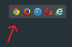
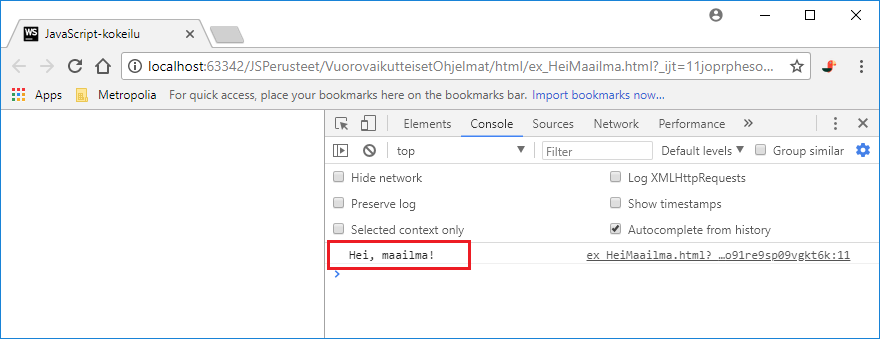

# Ohjelmointiympäristö

Tervetuloa opiskelemaan ohjelmointia JavaScript-kielellä!

JavaScript on selaimessa ajattava ohjelmointikieli, jolla voidaan tuottaa dynaamista, ohjelmallisesti luotua sisältöä web-sivuille.

Työkaluna käytetään WebStorm-kehitintä. Voit hankkia opiskelijalisenssin sivulla https://www.jetbrains.com/student/ ja sen jälkeen ladata tuotteen.

Pääset alkuun ohjelmien kirjoittamisessa seuraavan ohjeen avulla:

1. Luo uusi projekti (File/New/Project). Voit valita projektin tyypiksi Empty project. Nimeä projekti haluamallasi tavalla.
2. Varmista, että JavaScript versioksi on valittu EcmaScript 6
    1. Avaa File/Settings (win) tai WebStorm/Preferences (mac)
    1. Valitse vasemmalta Languages & Frameworks/JavaScript ja valitse listasta ECMAScript 6 ja ruksaa 'Prefer strict mode', jos se on vaihtoehtona.
    1. Valitse vasemmalta Editor/Code Style. CodeStyle-kolmiosta klikkaamalla aukeaaa lista kieliä. Valitse JavaScript
    1. Oikealla on linkki 'Set from'. Valitse 'Predefined style' ja sieltä 'Google JavaScript Style Guide'. Nyt voit muotoilla koodin automaattisesti näppäinyhdistelmällä _alt-ctrl-l_ tai _alt-cmd-l_ 
    1. Avaa File/Default settings ja tee kohdat i-iv uudestaan, jotta kaikissa uusissa projekteissa on samat asetukset.
2. Lisää projektiin HTML-tiedosto, jolla on haluamasi nimi, vaikkapa `esimerkki.html`.
3. Aseta tiedoston sisällöksi alla oleva ohjelmakoodi. Varsinainen JavaScript-koodi koostuu tässä yhdestä `console.log()`-lauseesta, joka tulostaa `Hei, maailma!`-tekstin.
Voit korvata sen haluamallasi ohjelmalla.

    ```javascript
    <!DOCTYPE html>
    <html lang="en">
    <head>
        <meta charset="UTF-8">
        <title>JavaScript-kokeilu</title>
    </head>
    <body>
        <script>
            'use strict';
            
            console.log('Hei, maailma!');
    
        </script>
    </body>
    </html>
    ```

4. Tallenna tiedosto Ctrl-S-näppäinyhdistelmällä.

5. Paina työskentelyalueen oikeassa laidassa kelluvan selainpalkin painiketta (ks. kuva). Sivu avataan ja JavaScript-koodi
suoritetaan valitsemassasi selaimessa. Tässä materiaalissa käytetään Chrome-selainta.

    

6. Kun Chrome-selain avautuu, paina F12-näppäintä tai alt-ctrl-i tai alt-cmd-i, jolloin selaimessa aukeaa kehittäjäpaneeli. Kehittäjäpaneelissa
näet ohjelman tuottamat konsolitulosteet (kuten tässä `Hei, maailma!`-tekstin) ja pääset tarkastelemaan ohjelman
mahdollisesti tuottamia virheilmoituksia. Ks. kuva alla.
    

Tässä kuvatulla tavalla voit opiskella ohjelmoinnin perusasiat. 
Myöhemmin tarkastellaan keinoja, joissa JavaScript-ohjelma saadaan reagoimaan käyttäjän verkkosivulla antamiin syötteisiin ja
päivittämään verkkosivulla olevia HTML-elementtejä joko käyttäjän syötteiden tai ulkoisista tietolähteistä
haettujen tietojen avulla.
