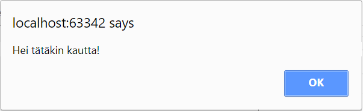
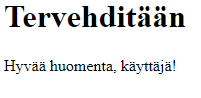
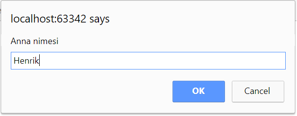

# Vuorovaikutteiset ohjelmat
Tässä moduulissa opitaan kirjoittamaan yksinkertaisia, vuorovaikutteisia
JavaScript-ohjelmia.

Vuorovaikutteisuudella tarkoitetaan mallia, jossa ohjelma
1. lukee käyttäjältä syötteitä
2. käsittelee syötteitä
3. tulostaa tuloksen.

Esimerkkinä tällaisesta on ohjelma, jossa käyttäjä antaa kaksi lukua ja ohjelma tulostaa
lukujen summan. Käyttäjä antaa kaksi syötettä: ensimmäisen ja toisen luvun (vaihe 1), ohjelma laskee niiden
summan (vaihe 2) ja ohjelma laskee tulostetun summan (vaihe 3).

## Tulostaminen

Aloitetaan yksinkertaisesta ohjelmasta, joka tuottaa käyttäjälle tulosteen.

JavaScript tarjoaa kolme tulostusvaihtoehtoa:
1. Konsolin lokituloste
2. Ponnahtava varoitusikkuna
3. Tulostus osaksi verkkosivua

Tutustutaan tässä kumpaankin tulostustapaan. Jatkossa rajoitutaan konsolin lokitulosteen käyttöön, koska se
on ohjelmoinnin opiskelun kannalta tarkoituksenmukaisempi: tulosteet saadaan kerralla näkyviin, eikä jokaisen
varoitusikkunan sisältöä tarvitse erikseen kuitata.

### Konsolin lokituloste
Konsolin lokituloste tuotetaan `console.log()`-metodilla.
Lokituloste näkyy selaimen kehittäjätilassa yleensä Console-välilehdellä.

```javascript
console.log('Hei, maailma!');
```

Tuloste konsoli-ikkunassa:

```monospace
Hyvää huomenta kaikille.
```

### Ponnahtava varoitusikkuna

Ponnahtava viesti-ikkuna tuotetaan `alert`-funktiolla:
```javascript
alert('Hei tätäkin kautta!');
```

Selainikkunaan ilmestyvä viesti-ikkuna näyttää tältä:


Tästä eteenpäin esimerkeissä käytetään konsolitulostusvaihtoehtoa eli `console.log()`-metodia.

### Tulostus osaksi verkkosivua

JavaScript-ohjelma voi tulostaa  HTML-sisältöä verkkosivun osaksi `document.write`-metodin avulla.
Esimerkiksi seuraava HTML-sivu sisältää JavaScript-osan, joka tulostaa kappale-elementin (`p`) sisällön ohjelmallisesti:

```html
<!DOCTYPE html>
<html>
<head>
    <meta charset="UTF-8">
    <title>JavaScript-kokeilu</title>
</head>
<body>
<h1>Tervehditään</h1>
    <script language="JavaScript">
        'use strict';
        var nimi = 'Aapo';
        document.write('<p>Hyvää huomenta, käyttäjä!</p>');
    </script>
</body>
</html>
```

Avattava verkkosivu näyttää selaimessa tältä:



Käytännössä ohjelmalliset tulostukset kerätään yleensä omiin funktioihinsa, joita kutsutaan jonkin tapahtuman - esimerkiksi 
verkkosivulla olevan painikkeen painamisen - seurauksena. Tämä tulostustapa edellyttää funktion käsitteen ja dokumenttioliomallin
hallintaa, joten sitä ei tässä yhteydessä käsitellä enempää.


### Merkkijonoliteraalit

Edellä tulostetut merkkijonot kuten `Hei, maailma` ovat esimerkkejä merkkijonoliteraaleista.
Literaalilla tarkoitetaan arvoa, joka kirjoitetaan ohjelmakoodin sellaisenaan eli ns. kovakoodataan.

Merkkijonoliteraalit kirjoitetaan aina lainausmerkkien sisään.

Esimerkkejä merkkijonoliteraaleista:
- `'Metropolia'`
- `'A2'`
- `'Tässä on pitkä palanen tekstiä.'`

Lainausmerkeistä JavaScript-tulkki tunnistaa, että kyseessä on merkkijonoliteraali.
 Tällöin tulkki osaa
käsitellä sitä oikein, esimerkiksi pyydettäessä tulostaa sen sisällön sellaisenaan.

## Muuttujat
Ohjelman tarvitsemia arvoja voidaan tallentaa muuttujiin.
Muuttujaan tallennettavia arvoja voidaan lukea ohjelman aikana monta kertaa,
ja kertaalleen asetettavia arvoja voidaan muuttaa.

JavaScript-kielen muuttujat määritellään `var`-lauseella.
Esimerkiksi muuttuja nimeltä `nimi` määritellään seuraavasti:
```javascript
var nimi;
```
Tässä vaiheessa muuttuja on määritelty eli ohjelman näkökulmasta
olemassa: sille voidaan asettaa arvo, ja sen arvo voidaan lukea. 
Arvon voi asettaa ja lukea kuinka monta kertaa tahansa; muuttujan arvon
voi kuitenkin lukea vasta sen äjlkeen kun muuttuja on alustettu
eli sille on asetettu arvo ensimmäisen kerran.

Edellä mainittu muuttuja voidaan alustaa seuraavasti:
```javascript
nimi = 'Milla';
```


Muuttuja voitaisiin myös määritellä ja alustaa samalla kertaa:
```javascript
var nimi = 'Milla';
```

Muuttujat ovat löyhästi tyypitettyjä, joten muuttujaa määriteltäessä
ei ole tarpeen kertoa, minkälainen arvo muuttujaan on tarkoitus tallentaa - 
onko kyseessä esimerkiksi kokonaisluku (kuten 17), liukuluku
 eli desimaaliluku (kuten 21.38) vai merkkijono
 (kuten "tietokone").

Esimerkiksi seuraava ohjelma määrittelee kaksi muuttujaa, joista ensimmäiseen
tallennetaan merkkijono ja toiseen kokonaisluku. Tämän jälkeen ohjelma
tulostaa muuttujien arvot, korvaa ne uusilla arvoilla ja tulostaa
muuttuneet arvot:


nimeltä luku, sijoittaa sen arvoksi
8, tulostaa sijoitetun arvon, kasvattaa arvoa kahdella ja lopuksi tulostaa kasvatetun
arvon:
```javascript
        var luku, nimi;
        luku = 153;
        nimi = 'Anna';
        console.log(luku);
        console.log(nimi);
        luku = -17;
        nimi = 'Pekka';
        console.log(luku);
        console.log(nimi);
```

Ohjelman tuottama tuloste:
```
153
Anna
-17
Pekka
```   
### Muuttujien tyypit

Edellä käsiteltiin kahden tyyppisiä muuttujia: kokonaislukuja ja merkkijonoja.
JavaScript-kielessä on kuusi muuttujien alkeistyyppiä:
- totuusarvo- eli boolean-tyyppi, jonka arvona voi olla true tai false
- numeerinen tyyppi, joka voi sisältää kokonais- tai liukuluvun.
- merkkijono
- null, joka ilmaisee, että arvo on tyhjä.
- undefined, joka ilmaisee, että määriteltyä muuttujaa
ei vielä ole alustettu, jolloin sen tyyppi ei ole tiedossa.
- symboli, jonka avulla voidaan luoda yksikäsitteisiä tunnisteita.

Edellä lueteltujen alkeistyyppien lisäksi JavaScriptissä on olemassa oliotyyppi,
joka voi sisältää rakenteeltaan mielivaltaisen monimutkaisia olioita.

Muuttujan tyyppi voidaan testata `typeOf`-operaatiolla:
```javascript
        var nimi = 'Ahmed';
        console.log(typeof nimi);
 ```
 Ohjelma tulostaa merkkijonon "string".
 
### Tyypin muuttaminen

Numeerinen muuttuja voidaan muuttaa merkkijonoksi        
        
        
### Merkkijonojen yhdistäminen
Merkkijonojen
yhdistäminen eli katenaatio toteutetaan `+`-operaatiolla.
Esimerkiksi seuraava lause rakentaa tulosteen kolmesta osamerkkijonosta:
```javascript
console.log('Hyvää' + ' huomenta' + ' kaikille.');
```

Tuloste:
```
Hyvää huomenta kaikille.
```

Vaihtoehtoisesti osajonot ja yhdistetty merkkijono voitaisiin 
tallentaa muuttujiin 
ja tulostaa sen muuttujan arvo, joka sisältää yhdistetyn merkkijonon:

```javascript
        var eka, toka, kolmas, kaikki;
        eka = 'Hyvää ';
        toka = 'huomenta ';
        kolmas = 'kaikille.';
        kaikki = eka + toka + kolmas;
        console.log(kaikki);
```       

## Syötteen luku
Aiemmissa esimerkeissä ohjelmien tuottamat tulosteet olivat aina samanlaisia, eikä
käyttäjä voinut millään tavoin vaikuttaa niiden sisältöön.

Sellaiset ohjelmat ovat harvinaisia. Yleensä halutaan, että käyttäjä voi antaa
ohjelmalle syötteitä, jotka vaikuttavat ohjelman kulkuun.

Syöte luetaan `prompt()`-funktiolla. Funktion argumenttina annetaan merkkijono, joka esitetään dialogi-ikkunassa käyttäjälle.

Seuraava lause kysyy käyttäjältä tämän nimen:

```javascript
     prompt('Anna nimesi.');
```
Selainikkunaan ilmestyy dialogi-ikkuna:



Tuossa muodossa kysymys on kuitenkin varsin hyödytön, sillä
käyttäjän antamaa nimeä ei oteta talteen. Niinpä käyttäjältä luetut syötteet tallennetaan lähes poikkeuksetta muuttujiin,
jotta luettuja syötteitä voidaan käyttää myöhemmin ohjelmassa.

Seuraava esimerkkiohjelma kysyy käyttäjän nimen ja tervehtii tätä
henkilökohtaisesti:

```javascript
     var nimi;
     nimi = prompt('Anna nimesi.');
     console.log('Hauska tavata, ' + nimi);
```

## Matemaattiset operaatiot

Numeerisiin muuttujiin voidaan kohdistaa matemaattisia operaatioita: niitä voidaan 
esimerkiksi laskea yhteen ja vähentää sekä pyöristää haluttuun tarkkuuteen.
Numeerisia arvoja voidaan myös tuottaa satunnaislukugeneraattorin avulla.

### Peruslaskutoimitukset

JavaScript-kielen peruslaskutoimitukset ovat:
- yhteenlasku (`+`)
- vähennyslasku (`-`)
- kertolasku (`*`)
- jakolasku (`/`)
- jakojäännös (`%`)

```javascript
        var luku = 3;
        luku = luku * 7;     // arvo on nyt 21
        luku = 1 + luku/2;   // arvo on nyt 11.5
        console.log(luku);
```
Seuraavilla operaatioilla voidaan muuttaa muuttujan arvoa yhdellä:

- lisäys yhdellä (`++`)
- vähennys yhdellä (`--`)

```javascript
        var luku = 3;
        luku++;     // arvo on nyt 4
        luku--;     // arvo on taas 3
        console.log(luku);
```


Arvoa voidaan myös muuttaa kerralla enemmän:
- lisäys vakiolla (`+=`)
- vähennys vakiolla (`-=`)
- kertominen vakiolla (`*=`)
- jakaminen vakiolla (`/=`)

```javascript
        var luku = 3;
        luku *= 2;    // arvo on nyt 6
        luku /= 3;    // arvo on nyt 2
        luku += 7;   // arvo on nyt 9
        luku -=8;    // arvo on nyt 1
        console.log(luku);
```


### Matemaattiset funktiot

Monet matemaattiset operaatiot - esimerkiksi kosinin laskeminen tai
neliöjuuren otto - toteutetaan `Math`-olion avulla käytettävien
matematiikkametodien avulla. Esimerkiksi seuraava ohjelma tulostaa 
luvun 3 neliöjuuren (`Math.sqrt`) sekä satunnaisluvun (`Math.random`) nollan ja yhden väliltä:

```javascript
        console.log(Math.sqrt(3));
        console.log(Math.random());
```

Math-olion tarjoamia metodeja ei tarvitse opetella ulkoa.
Kun kirjoitat koodia kehittimellä (esimerkiksi WebStorm) ja syötät
`Math`-sanan kirjoitettuasi pisteen, kehitin tarjoaa luettelon
tarjolla olevista metodeista ja vakioista. Luettelosta näet myös, mitä 
argumentteja kullekin metodeista on annettava; esimerkiksi
neliöjuurimetodi `sqrt` vaatii argumentiksi juurrettavan, kun taas satunnaisluvun
tuottava `random`-metodi ei tarvitse argumentteja,

Voit tutustua tarjolla oleviin metodeihin myös virallisen JavaScript-määrityksen kautta:
<http://www.ecma-international.org/ecma-262/6.0/> (luku 20.2.)
tai voit käyttää jotakin netin lukuisista JavaScript-lähteistä ja opetusmateriaaleista.

## Muuttujien automaattinen määrittäminen
JavaScript-ohjelmat suoritetaan oletusarvoisesti ns. löyhässä
tilassa (sloppy mode), jossa muuttujien määrittäminen `var`-sanalla
ei ole pakollista. Tällöin määritellään automaattisesti globaali
(eli koko ohjelman tasolla näkyvä) muuttuja aina, kun ohjelmoija
sijoittaa muuttujaan arvon ensimmäisen kerran.

Esimerkiksi seuraava ohjelma voitaisiin suorittaa näennäisen onnistuneesti:
```javascript
        var akseliväli = 0;
        aksleiväli = 2340;
        console.log('Akseliväli on: ' + akseliväli);
```

Ohjelma tulostaa kuitenkin akseliväliksi nollan; syynä siihen on
ohjelmoijan tekemä lyöntivirhe muuttujanimessä.
Ohjelma luo aluksi `var`-lausella määritellyn
`akseliväli`-nimisen muuttujan. Toisella rivillä kuitenkin sijoitetaan
arvo eri nimiseen, vahingossa väärin kirjoitettuun `aksleiväli`-nimiseen
muuttujaan. Tällöin luodaan automaattisesti toinen muuttuja.

Lopulta ohjelmassa on kaksi eri muuttujaa, ja ohjelma tulostaa
akseliväliksi nollan johtuen siitä, että oikea arvo `2340` oli
sijoitettu väärään muuttujaan. Sen
sijaan `var`-lauseella määritellyn, oikein kirjoitetun muuttujan arvo oli jäänyt nollaksi.

Kuvatun kaltaiset tilanteet luovat hankalasti löydettäviä semanttisia virheitä,
joissa ohjelman suoritus ei kaadu virheilmoitukseen vaan ohjelma
toimii sen sijaan väärin.

Niinpä `var`-lauseella määrittelemättömien globaalien muuttujien
 automaattinen luonti kannattaa estää. Tämän voi tehdä lisäämällä
 ohjelman alkuun `use strict` -lause, joka kirjoitetaan 
 alla olevaan tapaan heittomerkkeihin:
 
 ```javascript
         'use strict';
 ```

Tämän seurauksena ohjelma suoritetaan tiukassa tilassa (strict mode).
Tiukassa tilassa tulostuu virheilmoitus aina, kun määrittelemättömään
muuttujaan yritetään sijoittaa arvo. Globaalia muuttujaa ei enää
luoda automaattisesti, vaan se vaatii `var`-lauseen kirjoittamisen. Määrityksen käyttö muuttaa käyttäjän
vahingossa tekemät, mahdollisesti huomaamatta jäävät lyöntivirheet
näkyviksi syntaksivirheiksi. Tämä helpottaa oikein toimivien
ohjelmien kirjoittamista.

Edellä kuvatusta syystä `use strict` -määrityksen käyttö jokaisessa ohjelmassa kannattaa ottaa tavaksi.

## Nimetyt vakiot

Aiemmissa esimerkeissä käytettiin muuttujia, jotka määriteltiin
`var`-lauseella. Muuttujan arvoja voidaan nimensä mukaisesti
muutella ohjelman suorituksen aikana.

Toisinaan voi syntyä tilanne, jossa haluttaisiin luoda muuttuja jonkin
monimutkaisen arvon säilyttämiseksi, mutta tuon muuttujan arvoa ei
ole tarkoitus ohjelman suorituksen aikana muuttaa. Esimerkkinä
tällaisesta arvosta on vaikkapa kahden energian yksikön, kalorien ja joulien,
välinen muuntokerroin 4,1868.

Tällaisen muuttumattoman arvon säilyttämiseksi voidaan käyttää nimettyä vakiota,
joka määritetään `const`-sanalla. Nimetyn vakion arvo voidaan asettaa kerran,
mutta sitä ei voi muuttaa.

Seuraava ohjelma kysyy käyttäjältä kaksi kalorimäärää ja muuttaa ne jouleiksi:
```javascript
        const KERROIN = 4.1868;
        var k1, k2, j1, j2;
        k1 = prompt('Anna lounaan energiamäärä (kcal).');
        k2 = prompt('Anna päivällisen energiamäärä (kcal).');

        j1 = KERROIN * k1;
        j2 = KERROIN * k2;

        console.log('Sait aamiaisella '+j1+' kJ ja päivällisellä '+j2+' kJ.');
```

Nimetyn vakion `KERROIN` käyttö tiukassa tilassa (strict mode) varmistaa, että kummassakin
kertolaskussa käytetään oikeaa arvoa. Jos muuntokertoimet kirjoitettaisiin ohjelmakoodiin
kahteen kertaan, on mahdollista, että toisen kertoimen desimaalien kohdalla tulisi tehtyä näppäilyvirhe,
joka aiheuttaisi lopputulokseen pienen mutta hankalasti havaittavan laskuvirheen.

Nimetyt vakiot kirjoitetaan vakiintuneen käytännön mukaisesti suurin kirjaimin.

## Harjoitustehtävät

1. Kirjoita ohjelma, joka tulostaa näytölle tekstin 'Tämä on JavaScript-ohjelma!'

2. Kirjoita ohjelma, joka kysyy nimesi ja sen jälkeen tervehtii sinua omalla nimelläsi. Esimerkkejä:

    - Jos syötät nimeksesi Viivi, ohjelma tervehtii sinua sanoin 'Terve, Viivi!'
    - Jos syötät nimeksesi Ahmed, ohjelma tervehtii sinua sanoin 'Terve, Ahmed!'
    
3. Kirjoita ohjelma, joka kysyy ympyrän säteen ja tulostaa sen pinta-alan.

    - Selvitä, miten saat käyttöösi piin tarkan likiarvon. Ks. https://developer.mozilla.org/en-US/docs/Web/JavaScript/Reference.

4. Kirjoita ohjelma, joka kysyy suorakulmion kannan ja korkeuden. Ohjelma tulostaa suorakulmion piirin ja pinta-alan. Suorakulmion piiri tarkoittaa sen neljän sivun yhteispituutta.
    
5. Kirjoita ohjelma, joka kysyy kolme kokonaislukua. Ohjelma tulostaa lukujen summan, tulon ja keskiarvon.

6. Kirjoita ohjelma, joka kysyy käyttäjältä massan keskiaikaisten mittojen mukaan leivisköinä, nauloina ja luoteina. Ohjelma muuntaa syötteen täysiksi kilogrammoiksi ja grammoiksi sekä ilmoittaa tuloksen käyttäjälle.
    - Yksi leiviskä on 20 naulaa, yksi naula on 32 luotia ja yksi luoti on 13,3 grammaa.

    - Esimerkki ohjelman tulosteesta, kun käyttäjä antaa syötteenä 3 leiviskää, 9 naulaa ja 13,5 luotia:
    
        ```
        Massa nykymittojen mukaan:
        29 kilogrammaa ja 545.95 grammaa. 
        ```

7. Kirjoita ohjelma, joka kysyy käyttäjältä tilin saldon sekä vuotuisen korkoprosentin.
Ohjelma ilmoittaa vuodessa kertyvän koron määrän sekä kasvaneen saldon, johon on lisätty vuosikorko.
Kaikki rahasummat tulostetaan sentin tarkkuudella oikein pyöristettyinä.

8. Monopoli-pelissä pelaaja heittää kahta noppaa ja etenee silmälukujen summan verran.
   Kirjoita ohjelma, joka arpoo kaksi nopan silmälukua. Ohjelma tulostaa viesti-ikkunassa arvotut silmäluvut sekä niiden alapuolella eri rivillä silmälukujen summan.
   
   - Käytä funktiota `Math.random()`.
   
9. Kirjoita ohjelma, joka arpoo ja tulostaa kaksi erilaista numerolukon koodia:

    1. Kolmenumeroisen koodin, jonka kukin numeromerkki on väliltä 0..9.
    2. Nelinumeroisen koodin, jonka kukin numeromerkki on väliltä 1..6. 


